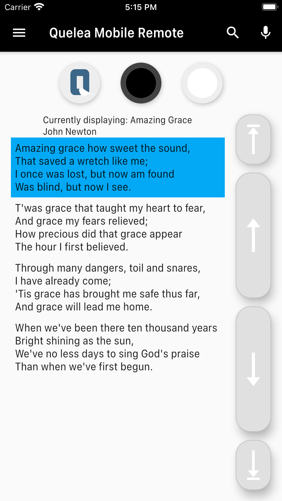
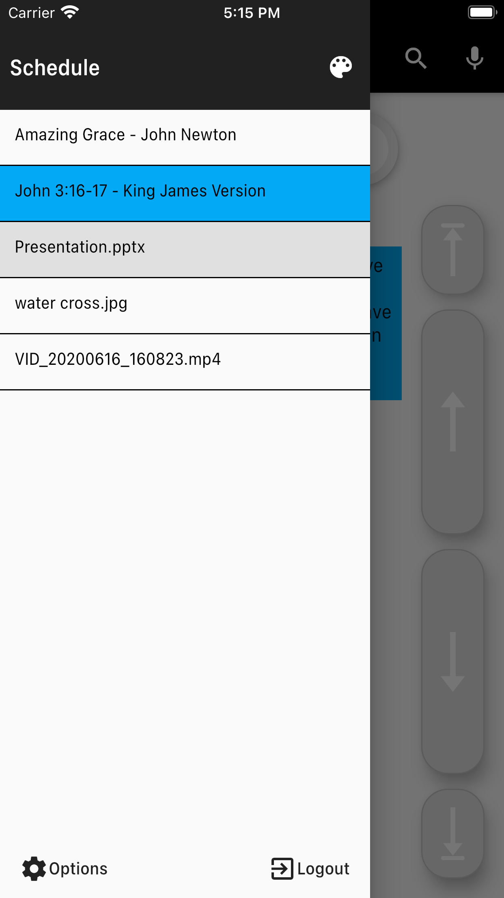
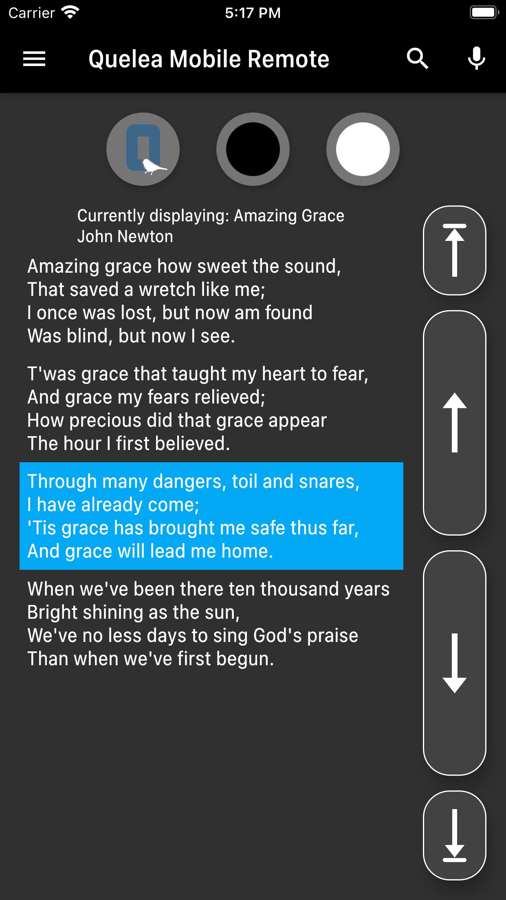

# Quelea Mobile Remote (Flutter version)
 

Quelea Mobile Remote is an Android and iOS app that allows you to remotely control the free church projection software Quelea. It is a customized version of the web site remote control feature for easier access.

The entire code is open source, so free to help improve the code or to use it for your own projects.

&nbsp;&nbsp;&nbsp;  &nbsp;&nbsp;&nbsp; 

## Download:
Download the app through the [Google Play Store](https://play.google.com/store/apps/details?id=org.quelea.mobileremote) for Android or the [Apple Store](https://apps.apple.com/app/id1535967266) for iOS. You can clone or download the project here at Github. Feel free to help improve the code or to use it for your own projects.

## Manual
[Instructions for using the app](https://quelea-projection.github.io/docs/Remote_Control_Manual)

## Troubleshooting
[Troubleshooting checklist](https://quelea-projection.github.io/docs/Remote_Control_Troubleshooting)

## Features:
* See which item currently is live
* The lyrics of the current song with clickable slides
* Dedicated buttons for logo, black and clear to hide the text
* Dedicated buttons for next and previous slide/item
* View Quelea schedule and which item is live and which is in preview through sidebar menu
* Store sever URL
* Add a bible passage or a song to the schedule
* Start/stop recordings
* Navigation via volume buttons (Android) or keyboard shortcuts
* Auto-connect feature (optional)
* [Change global themes](https://quelea.org/wiki/index.php/Themes#Set_a_global_theme)

## Prerequisites:
* [Quelea 2015.3 or later](https://sourceforge.net/projects/quelea/files/)
* [Active Mobile Remote server](http://quelea.org/wiki/index.php/Mobile_Remote#Activating_Mobile_Remote)
* Access to the same network as the server

## Known issues:
 None

## Permissions:
* *Full network access* - Only used to connect to the Quelea server. The app can be used with no Internet connection as long as it has access to the same network as the server.
* *Prevent phone from sleeping* - Means that the screen is kept active as long as the app is running. It is possible to manually turn off the screen at any time.
* *View Wi-Fi connections* - Used in auto-connect feature to find server IP.

## Reporting bugs/Suggesting features
If you find any bugs or have any problems getting started, just [add an issue](https://github.com/ArvidNy/quelea-flutter-remote/issues) to the project. In the same way you can also let me know if you have any suggestions or other feedback.

## Donations
All kinds of donations are appreciated and will allow me to set aside more time for development and cover fees that needs to be payed to publish the apps. You can use [GitHub Sponsors](https://github.com/sponsors/ArvidNy) for a monthly donation or send a one-time donation through [PayPal](https://www.paypal.me/ArvidNy).